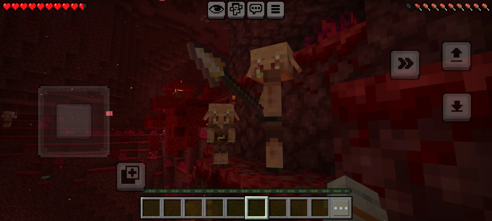

# 盲敌成友 Blind Enemies

[English](README.md) | 简体中文

> 版本 26.1.9 更新内容
> 
> 此版本需要在「编辑世界 → 实验性游戏内容」中开启测试版API才会生效。
> 
> - 嘎枝（Creaking）不再攻击玩家
> - 烈焰人（Blaze）不再有小概率对玩家产生敌意

**Blind Enemies** 是一个 Minecraft 基岩版（Bedrock Edition）Addon，用于让绝大多数敌对生物对玩家变为友好。

安装本模组后，大多数敌对生物将不再主动攻击玩家，即使玩家攻击它们，它们通常也不会还手。  
同时，本模组尽量保留了生物之间的战斗行为，因此游戏世界依然保持原有的生态互动。

这个模组非常适合：

- 喜欢探索而不喜欢频繁战斗的玩家
- 想获得更轻松生存体验的玩家
- 希望与生物互动而不是战斗的玩家

## 特性

- 绝大多数敌对生物对玩家变为友好
- 玩家攻击时生物通常不会还手
- 尽量保留生物之间的战斗行为
- 不会对原版玩法造成大幅度改变

## 设计说明

以下生物 **刻意没有修改**：

- **末影龙**
- **凋灵**

## 使用场景

适用于：

- 轻松探索
- 在生存模式中安心建造
- 不喜欢与怪物战斗的玩家
- 更友好的游戏体验

## 安装方法

1. 下载 addon 文件
2. 导入 Minecraft 基岩版
3. 在世界设置中启用该模组

## 许可证

MIT License 